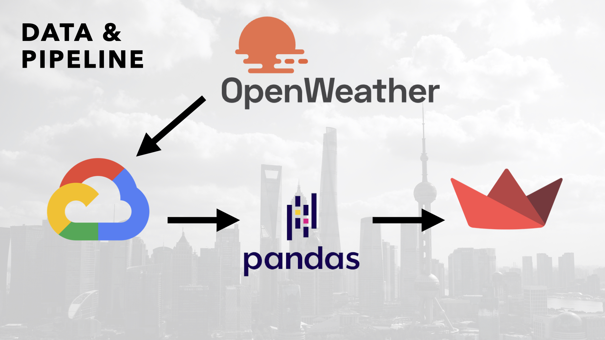
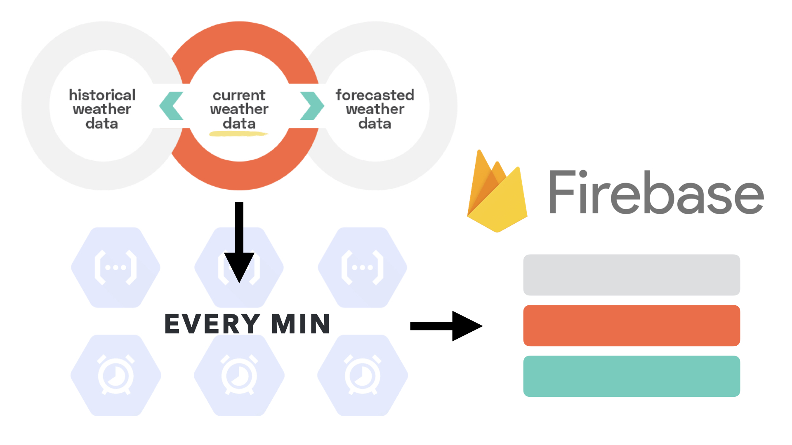
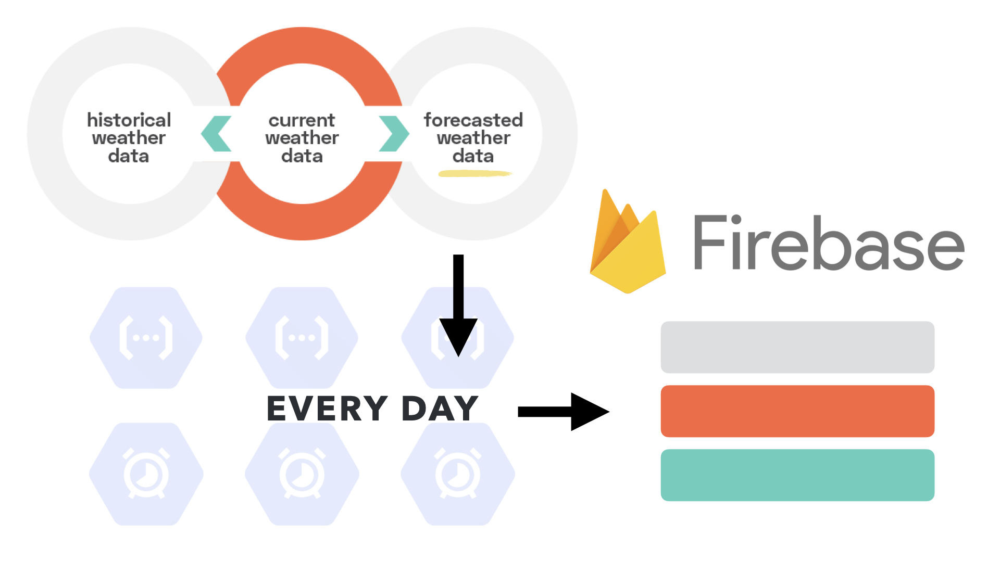
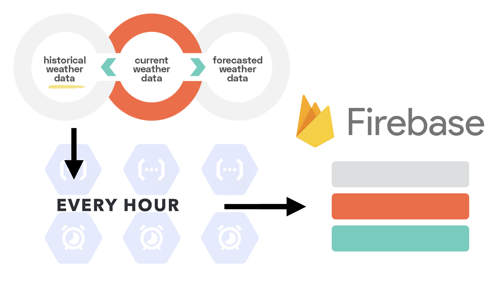
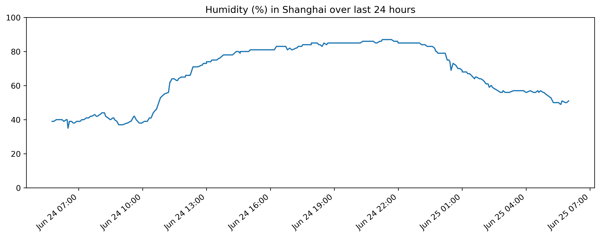

# **MAINTAINING A LANE HOUSE RENTAL PROPERTY PORTFOLIO IN SHANGHAI**
Leslie Cardone  
June 25, 2021  
Metis: Data Engineering

## ABSTRACT

There is a niche market in Shanghai, China where property management companies will seek out long term leases with owners of the European-style houses in the Former French Concession. These house, built from the late 1800s to the early 1930s are now in a state of disrepair. 

The management companies invest money to fix and renovate apartments in these houses. The newly renovated apartments are then marketed and rented out, at a higher price, to international (and local) professionals in the city. 

These properties, because of their age, are especially vulnerable to Shanghai's humidity and rain. Black mold, leaks, and water damage can get out of contorl if not monitored carefully.

The goal of this project is to construct a data pipeline for live weather updates (specifically humidity, temperature, and rain) so that property managers can visualize trends in weather and take preventative measures during stretches of high humidity and before heavy rainfall.

## DATA

I collected the data for this pipeline from the [Open Weather Map](https://openweathermap.org/api) API. I specifically used the "Current Weather Data" and "One Call API" under the free subscription plan.

I am currently pulling current weather conditions every minute, 7 day forecast predictions every day, and weather history by hour every hour. At this rate, I will reach 100,000 data points in about two months.

The data is stored in Google Firestore. The collections are categorized by the three types of API pulls (current, forecast, and history). Within each collection, a document is a dictionary of weather information for the time requested.

## ALGORITHMS/TOOLS

*LIBRARIES*
- pyowm to call the Open Weather Map API
- firebase_admin to push data to the Google Firestore
- google-cloud-firestore to query the database
- pandas for EDA and dataframe manipulation
- matplotlib for visualizations

*DATABASE*  
Google Cloud Firestore

*CLOUD PROCESSING*  
Google Cloud Functions
Google Cloud Scheduler

*WEB APPLICATION*  
Streamlit (in Progress)

## COMMUNICATION
*VISUALIZATIONS*

**Overview**

   
1. API Call to OpenWeather
2. Data stored in Google Firestore
3. Data cleaned and processed in pandas
4. Data deployed to Streamlit

**API Calls:**

1. Current weather data every minute
2. 7-day Forecast data every day
3. 3-day history every hour
    - at the hour pulled, the history will show the weather condition for that hour the previous day, the day before, and two days before
4. All scheduled by Google Cloud Scheduler

**DATA Query:**

Query for humidity -- produces minute by minute humidity percentage from time of query to 24 hours previous.